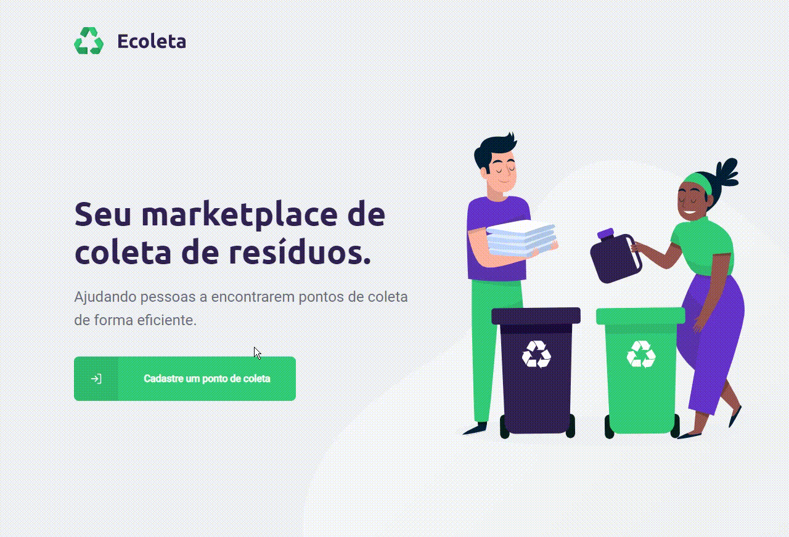

# Ecoleta

## About
As we are in the semantics of the environment, nothing better than making an application focused on it.
Ecoleta is an application for garbage collection. You can find the nearest point to your home to take your trash there. You can register your recycling company.

---

| Este projeto esta sob [licença MIT ](https://github.com/ENSE).

|				Criado com :heart: by [Cleilton Timoteo](https://github.com/name)